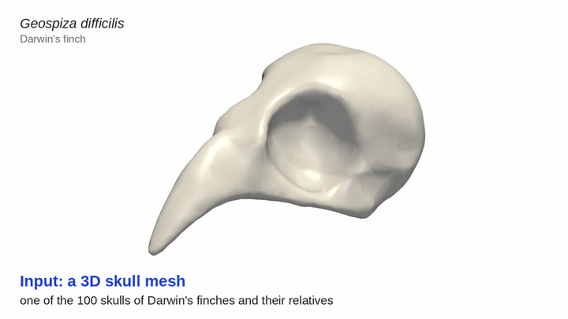

# Robust Parametric Estimation of Avian Cranial Morphology

Python code and data for measuring skull dimensions, orbital radius and neurocranial shape from prepared 3D skull meshes.

By **Kaikwan Lau and Gary P. T. Choi**.

[Project website](https://kaikwanlau.github.io/skull-morphology/) · [Getting started](docs/START_HERE.md) · [Read the paper](https://arxiv.org/abs/2511.06426)

<p align="center"><a href="docs/assets/demo.mp4"></a></p>

## Getting started

1. Choose **Code → Download ZIP** above, then extract the files.
2. Follow the [installation guide](docs/START_HERE.md#1-download-and-install) for your operating system. It covers Python 3.12 and the required packages.
3. With the project environment activated, run this command from the project folder:

```bash
python quickstart.py
```

The example fits one orbit of the supplied `G.DifficilisA.stl` skull. Open **`output/quickstart/inspection.png`** to inspect the fit and **`measurements.csv`** to see the measurements. **`run.json`** records the settings and software versions.

This example uses an already prepared mesh and runs without MATLAB or an interactive 3D window. To analyse your own specimens, follow [Use your own skulls](docs/START_HERE.md#use-your-own-skulls). To run the study analyses, follow [Reproduce the paper](docs/REPRODUCE.md).

## Data files

All study data are in [`data/`](data/).

| File or folder | Contents |
| :--- | :--- |
| [`DF_and_their_relatives/`](data/DF_and_their_relatives/) | Prepared meshes of 100 Darwin’s finches and their relatives |
| [`Dataset.xlsx`](data/Dataset.xlsx) | Measurements and prediction results for the 100 finch specimens |
| [`Dataset_training.xlsx`](data/Dataset_training.xlsx) | Measurements for the 50 training specimens |
| [`Dataset_other_taxa.xlsx`](data/Dataset_other_taxa.xlsx) | Records for 51 additional birds and 2 rodent examples |

Additional bird meshes, four exploratory human crania and figure inputs are also included. See [data sources and scope](data/README.md) for the full inventory, fitting limitations and source attributions.

## Geometric analysis scripts

These scripts are in [`2_fitting/`](2_fitting/).

| Script | Purpose |
| :--- | :--- |
| [`fit_sphere.py`](2_fitting/fit_sphere.py) | Fit orbital spheres to the supplied finch skulls and save measurements |
| [`fit_ellipsoid.py`](2_fitting/fit_ellipsoid.py) | Fit axis-aligned ellipsoids to the neurocranium and save semi-axis lengths |
| [`bounding_AABB.py`](2_fitting/bounding_AABB.py) | Inspect the axis-aligned skull dimensions |
| [`bounding_OBB.py`](2_fitting/bounding_OBB.py) | Inspect an oriented bounding box |
| [`fit_sphere_batch.py`](2_fitting/fit_sphere_batch.py) | Process folders of prepared skulls and save inspection images |

Use the [fitting guide](docs/START_HERE.md#use-your-own-skulls) to choose inputs and settings. Prepared bird meshes need coordinates in **millimetres**, with the **beak at −x, posterior at +x and dorsal direction +z**. Inspect every fit before interpreting its measurements; the supplied defaults were selected for finches.

## Statistical analysis scripts

These scripts are in [`3_statistics/`](3_statistics/) and read the released Excel workbooks.

| Script | Purpose |
| :--- | :--- |
| [`correlation.py`](3_statistics/correlation.py) | Plot and summarise relationships between skull dimensions and orbit measurements |
| [`correlation_specific.py`](3_statistics/correlation_specific.py) | Analyse a selected relationship |
| [`correlation_combined.py`](3_statistics/correlation_combined.py) | Compare skull dimensions, ellipsoid axes and orbit curvature |
| [`modelling.py`](3_statistics/modelling.py) | Fit the curvature prediction model using the training specimens |

See [Reproduce the paper](docs/REPRODUCE.md) for commands and outputs. New fitting results do not automatically replace the released workbooks used by these analyses.

## Other workflows

| Task | Where to go |
| :--- | :--- |
| Prepare raw scans | [MATLAB remeshing setup](1_remeshing/Remeshing/README.md) |
| Compare both orbits | [Bilateral fitting scripts](docs/REFERENCE.md#4-bilateral-fits) |
| Generate figures or animation | [Figure and media guide](docs/REPRODUCE.md#figures-and-media) |
| Check the encoded paper results | [Numerical verification](docs/REPRODUCE.md#numerical-verification) |
| Find any script’s inputs and outputs | [Full script reference](docs/REFERENCE.md) |

The [project website](https://kaikwanlau.github.io/skull-morphology/) includes the animation, video tutorial and illustrated guides. After downloading the repository, you can also open **`docs/index.html`** to use it offline.

## Cite this work

Kaikwan Lau and Gary P. T. Choi. *[Robust Parametric Estimation of Avian Cranial Morphology](https://arxiv.org/abs/2511.06426).* arXiv:2511.06426 (2025).

```bibtex
@article{lau2025robust,
  author = {Lau, Kaikwan and Choi, Gary P. T.},
  title = {Robust Parametric Estimation of Avian Cranial Morphology},
  journal = {arXiv preprint arXiv:2511.06426},
  year = {2025},
  eprint = {2511.06426},
  archivePrefix = {arXiv},
  primaryClass = {q-bio.QM}
}
```

Code license: **[Apache License 2.0](LICENSE)**. Bundled MATLAB dependencies retain their [third-party licenses and credits](1_remeshing/Remeshing/THIRD_PARTY.md). See the original data sources for their attribution and reuse terms.

[Report an issue](https://github.com/kaikwanlau/skull-morphology/issues) · [Script reference](docs/REFERENCE.md)
